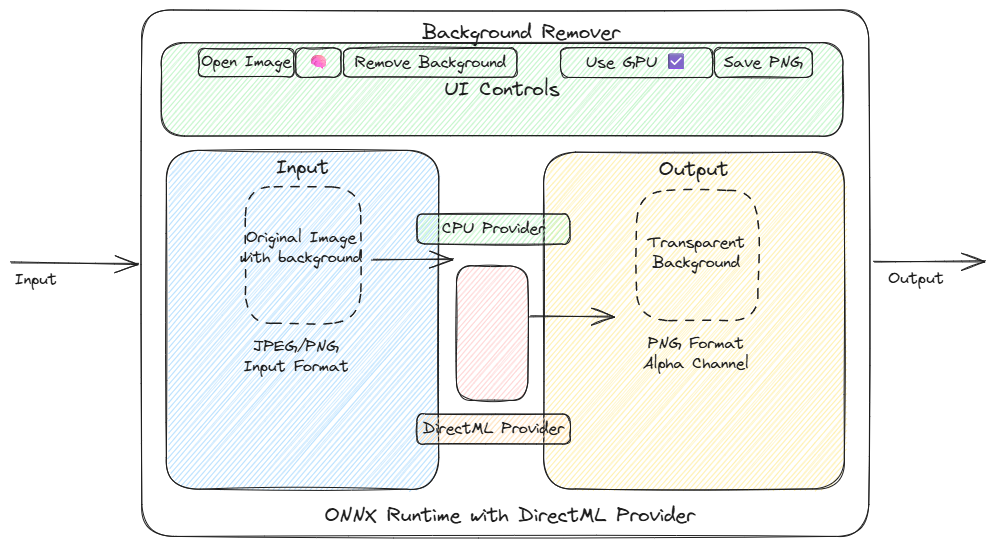

# Windows On-Device AI Lab: Background Remover (Python + ONNX Runtime)



This lab builds a small Windows desktop app that removes image backgrounds entirely on-device using ONNX Runtime (via the `rembg` library). After the first model download, it runs offline.

Why this is a good lab:
- Useful output: quickly create transparent PNGs of product shots, profile pics, etc.
- Fully local inference: showcases on-device AI.
- Easy setup: minimal code and dependencies.
- Windows GPU optional: works with DirectML if available.

## Prerequisites
- Windows 10/11
- Python 3.12+
- Optional for GPU: a DirectX 12-capable GPU and drivers

## Setup

```powershell
# 1) Create and activate a virtual environment
python -m venv .venv
.\.venv\Scripts\activate

# 2) Install dependencies
pip install -r requirements.txt
```

The requirements now include the DirectML-enabled ONNX Runtime by default, which provides both GPU acceleration and CPU fallback.

Notes:
- `rembg` will download the model on first run to your user cache. Default here is `u2netp` (small, quick). For higher quality later, switch to `isnet-general-use` in the UI dropdown.
- Everything runs locally; no data leaves your machine.

## Run

### Recommended: PowerShell script

```powershell
.\run.ps1
```

This script will:
- Activate the virtual environment
- (Optionally) set a custom model directory (uncomment in script)
- (Optionally) enable GPU mode with `-gpu`
- Run the app in GUI or CLI mode


**GUI mode:**
```powershell
.\run.ps1
```
Then:
- Click **Open Image** to load a file (JPG/PNG)
- Choose a model (start with `u2netp` for speed)
- **[NEW]** Use the **Use GPU (DirectML)** checkbox:
	- If a compatible GPU is detected, the checkbox is enabled and checked by default (GPU will be used for inference).
	- If no compatible GPU is detected, the checkbox is grayed out and CPU will be used.
	- You can uncheck the box to force CPU usage even if a GPU is available.
- Click **Remove Background**
- Click **Save PNG** to export with transparency

**CLI mode:**
```powershell
.\run.ps1 -infile path\to\image.jpg -outfile path\to\out.png -model u2netp
```


**Provider selection (CPU/GPU):**
- The app automatically detects if your system supports DirectML (GPU acceleration).
- The **Use GPU (DirectML)** checkbox in the GUI lets you control whether to use GPU or CPU for inference.
- If GPU is not available, the checkbox is grayed out and CPU will be used.
- If GPU is available, the checkbox is checked by default (GPU will be used), but you can uncheck it to force CPU mode.

**Set a custom model directory:**
Uncomment the `$env:REMBG_MODEL_DIR` line in `run.ps1` and set the path to your models folder.


## Troubleshooting

- If you want GPU acceleration but don't see the **Use GPU (DirectML)** checkbox enabled, ensure you have a DX12-capable GPU with up-to-date drivers. The app shows the active providers (CPU/GPU) in the status bar at the bottom.
- First run downloads the model (a few MB for `u2netp`; larger for `isnet-general-use`). Afterwards it runs fully offline.
- If Tkinter is missing, install a standard Python from python.org (it includes Tkinter on Windows).


## How it works

- The app uses `rembg` which wraps ONNX Runtime models for person/object segmentation (e.g., U^2-Net family, IS-Net).
- We create a session and run inference locally, returning a transparent PNG.
- ONNX Runtime with DirectML is used, which can leverage your GPU when available or fall back to CPU. The provider selection is controlled by the GUI checkbox.

### Application Architecture


### AI Background Removal Process


The diagram above illustrates how the background removal process works:
1. Input images are processed through the rembg.remove() function
2. The selected neural network model (U2Net, ISNet, etc.) performs image segmentation
3. DirectML provides GPU acceleration when available and selected
4. CPU fallback is used when GPU is unavailable or not selected
5. The result is an image with transparent background

## Try better quality

- Switch the model in-app to `isnet-general-use` for improved edges (larger download, slower on CPU, typically much better results).
- You can also try `u2net` (larger than `u2netp`) as a middle ground.


---

**Enjoy building!**